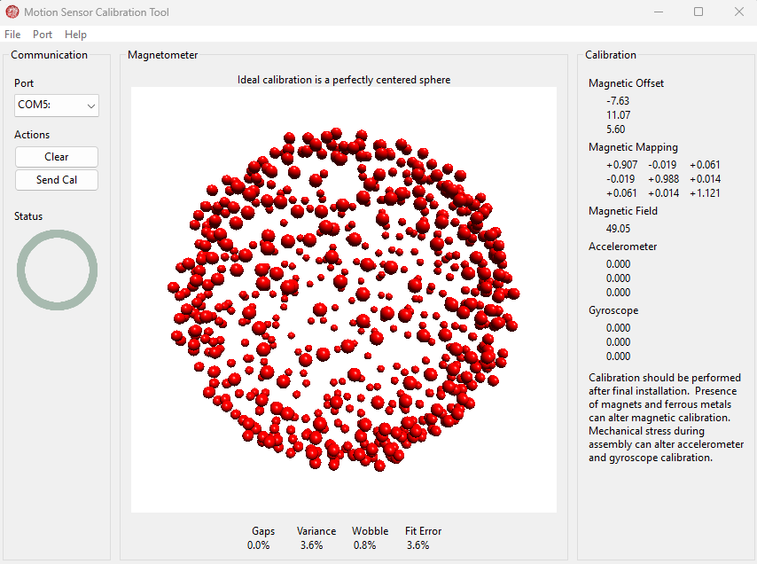

# Attitude and heading reference system (AHRS)
This is example code for use of an MPU9250 9-DoF accelerometer, gyro,
and magnetometer.  It will output orientation data usable with the
[Adafruit 3D Model Viewer](https://adafruit.github.io/Adafruit_WebSerial_3DModelViewer/)

Before use, the sensor should be calibrated as described in the 
[Adafruit AHRS Motion Sensor Fusion Overview](https://learn.adafruit.com/how-to-fuse-motion-sensor-data-into-ahrs-orientation-euler-quaternions/overview)
using the [calibration](../calibration/README.md) example.  The calibration
data should be used to update the sensor_adj structure in main.cc.

For this sample calibration

the sensor_adj structure should be set to

    sensor_adj_t sensor_adj = {{-7.63, 11.07, 5.60},
                               {{  0.907, -0.019,  0.061},
                                { -0.019,  0.988,  0.014},
                                {  0.061, -0.014,  1.121}},
                               {0.0, 0.0, 0.0},
                               {0.0, 0.0, 0.0}};

based on the "Magnetic Offset" and "Magnetic Mapping".

The example supports both the Mahony and Madgwick algorithms.  Selection is
done through a macro, but for convenience this can be set using a CMake
cache entry named AHRS_ALGO which can be set to MADGWICK or MAHONY.
The cmake command for the example should be of the form:

    cmake -DPICO_PLATFORM=<rp2350|rp2040> \
          -DPICO_BOARD=<pico|pico_w|pico2|pico2_w> \
          -DMPU9250_BUS=<I2C|SPI> \
          -DAHRS_ALGO=<MADGWICK|MAHONY> \
          <path to library>/pico-MPU9250/examples/AHRS

As an example if compiling the program for a pico2_w using the Mahony AHRS
algorithm where the sensor is attached through the SPI bus and the MPU9250
library is located at /home/jfredine/pico-MPU9250, the command would be:

    cmake -DPICO_PLATFORM=rp2350 \
          -DPICO_BOARD=pico2_w \
          -DMPU9250_BUS=SPI \
          -DAHRS_ALGO=MAHONY \
          /home/jfredine/pico-MPU9250/examples/AHRS
