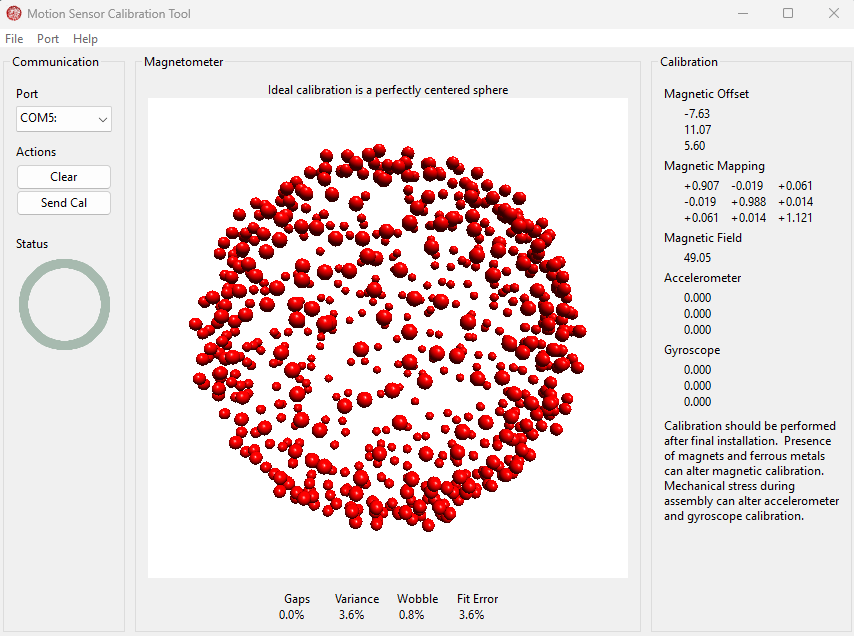

# Calibration
This is example code for use of an MPU9250 9-DoF accelerometer, gyro,
and magnetometer.  It will output data usable with the
[calibration program](https://www.pjrc.com/store/prop_shield.html) from
PJRC.  The calibration step is an important first step to create an
accurate [AHRS](../AHRS/README.md).

The cmake command for the example should be of the form:

    cmake -DPICO_PLATFORM=<rp2350|rp2040> \
          -DPICO_BOARD=<pico|pico_w|pico2|pico2_w> \
          -DMPU9250_BUS=<I2C|SPI> \
          <path to library>/pico-MPU9250/examples/calibration

As an example if compiling the program for a pico2_w where the sensor is
attached through the SPI bus and the MPU9250 library is located at
/home/jfredine/pico-MPU9250, the command would be:

    cmake -DPICO_PLATFORM=rp2350 \
          -DPICO_BOARD=pico2_w \
          -DMPU9250_BUS=SPI \
          /home/jfredine/pico-MPU9250/examples/AHRS
